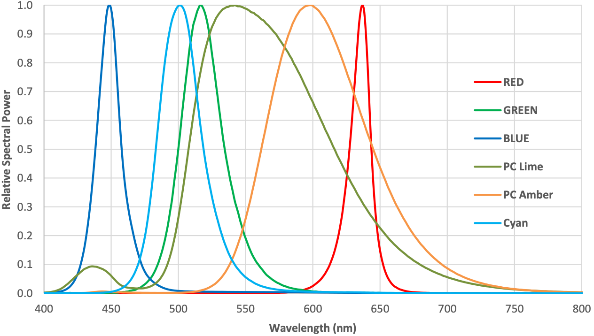

# Sick LED Driver

Six channel LED driver board for the [LZ7-04-M2PD](https://www.osram.com/ecat/LED%20ENGIN%20LuxiGen%20LZ7-04M2PD/com/en/class_pim_web_catalog_103489/prd_pim_device_13582430/) (on a MCPCB) from LED Engin. It's a 60W LED with six colours, which can be used to do some adjustable white experiments due to the relatively full spectrum (at least compared to a normal RGB-LED): 

Source: [LED Datasheet](https://dammedia.osram.info/media/resource/hires/osram-dam-14744640/LZ7-04M2PD_EN.pdf)

## Components
 * LED Driver: **BP1808**
 * MCU: **STM32F103C8**

## Software:
The objective of the project is to make development super easy. Thus, the software is going to be based on Arduino.