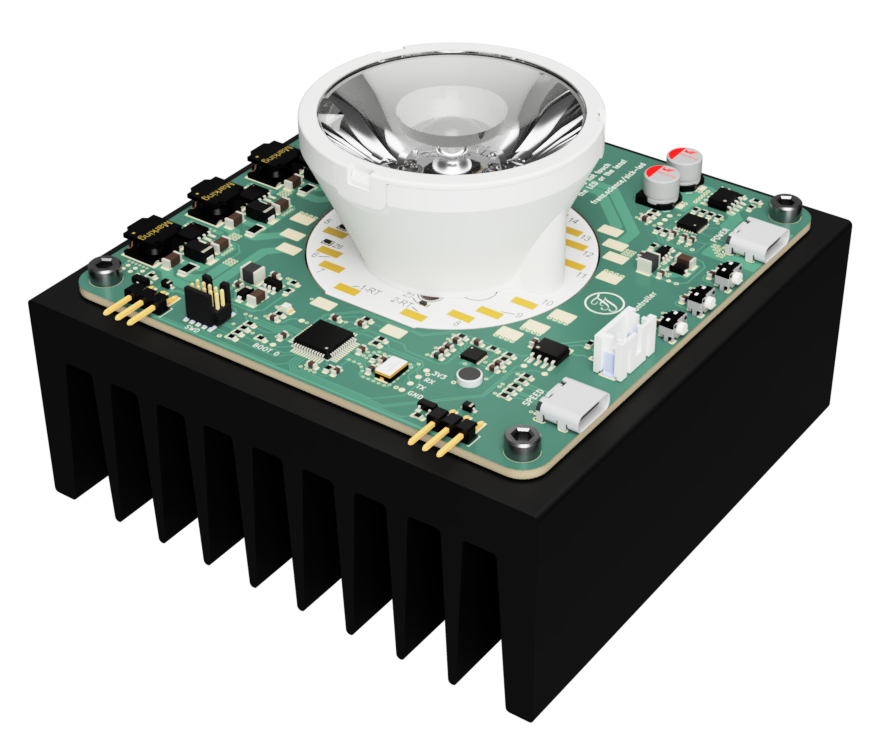
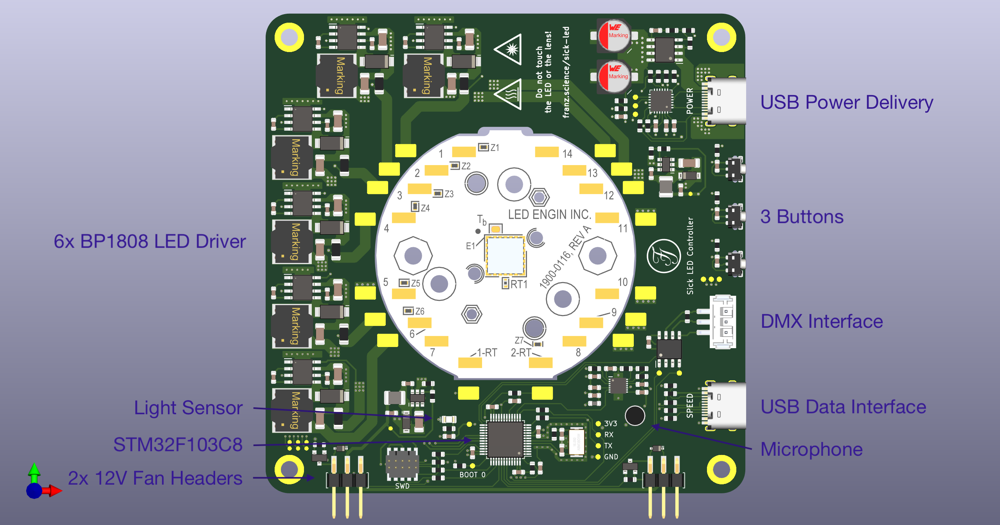
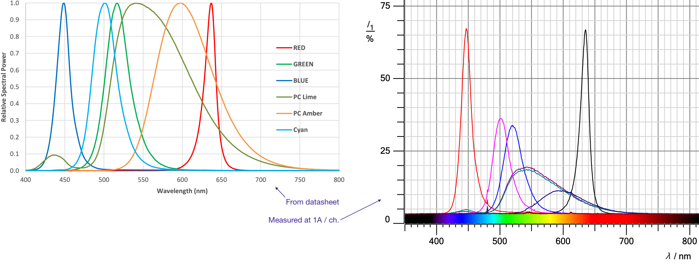

# Sick LED Driver

## [Schematic](https://franz.science/sick-LED/Schematic.pdf)
## [iBOM](https://franz.science/sick-LED/Hardware/KiCad-Files/bom/index.html)
  
**\*Work in progress\***

Six channel LED driver board that is built around the [LZ7-04-M2PD](https://www.osram.com/ecat/LED%20ENGIN%20LuxiGen%20LZ7-04M2PD/com/en/class_pim_web_catalog_103489/prd_pim_device_13582430/) on MCPCB from LED Engin.

 It's a 60W LED with six colours, which can be used to do some adjustable white experiments due to the relatively full spectrum of the LED (at least compared to a normal RGB-LED): 

The project's objective is not to build an LED that is as bright as possible but to create a dev board that makes it easy to study RGBALC LEDs. Thus, the board is powered via USB-PD and programmed with Arduino.

## Hardware
The PCB is mounted on a heatsink (100x100x40mm black anodised aluminium) using four M3 screws. Two 40mm fans could be attached to the heatsink and powered using the provided 2.54mm headers (the thermal characteristics of the whole design have not been tested yet).  

### Known (Hardware) Bugs
* Each PWM Channel had to be pulled down with a 4.7kΩ resistor.
* FAN1 pin (PB5, TIM3_CH2) cannot be used as PWM output when Hardware-I2C is initialised (Ch. 2.8.7 [ST Errata Sheet](https://www.st.com/resource/en/errata_sheet/es093-stm32f100x4-stm32f100x6-stm32f100x8-and-stm32f100xb-low-and-mediumdensity-value-line-device-limitations-stmicroelectronics.pdf)).

### Fusion360 online viewer
https://a360.co/2VWAmD9

#### LED Driver (BP1808)
\*Docu\*

#### MCU
\*Docu\*

#### USB-C PD Chip
\*Docu\*

#### Buck Converter
\*Docu\*

#### RS-485 Transceiver
\*Docu\*

#### Microphone Amplifier
\*Docu\*

#### Light Sensor
\*Docu\*

## Software
To this point, the software is very basic. It allows the individual channels to be controlled from a computer (Linux or macOS) with [QLC+](https://www.qlcplus.org). It therefore pretends to be a nanoDMX device (No nanoDMX implementation in QLC+ on Windows, apparently).  
The buttons, microphone, light sensor and DMX interface are not yet implemented.  
The software should be rewritten using STM32Cube framework (in progress™).